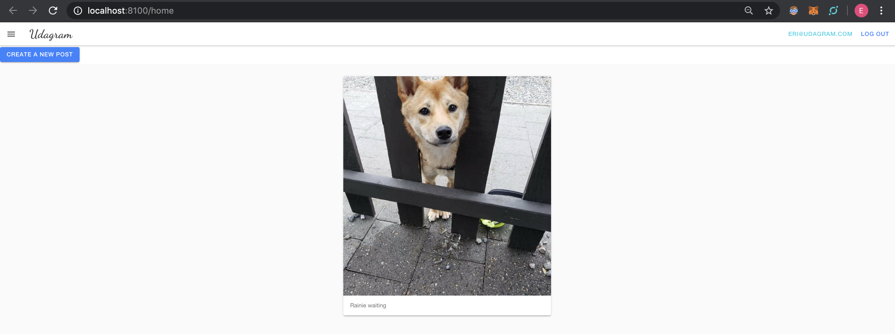
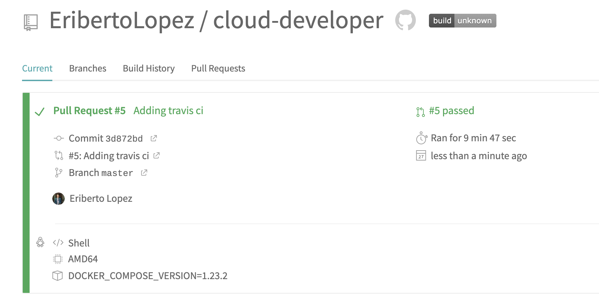
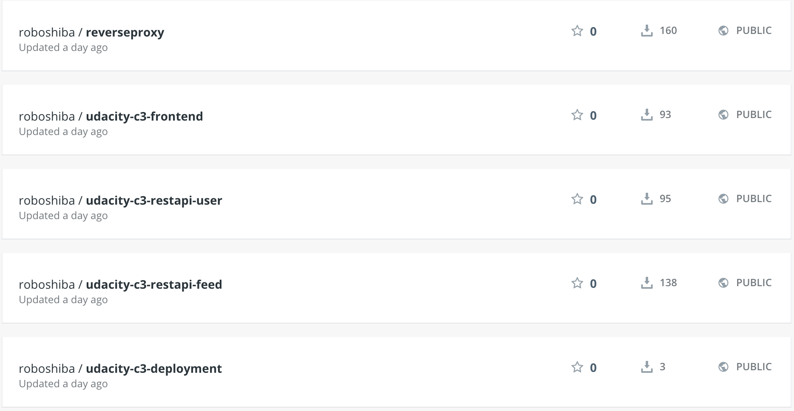
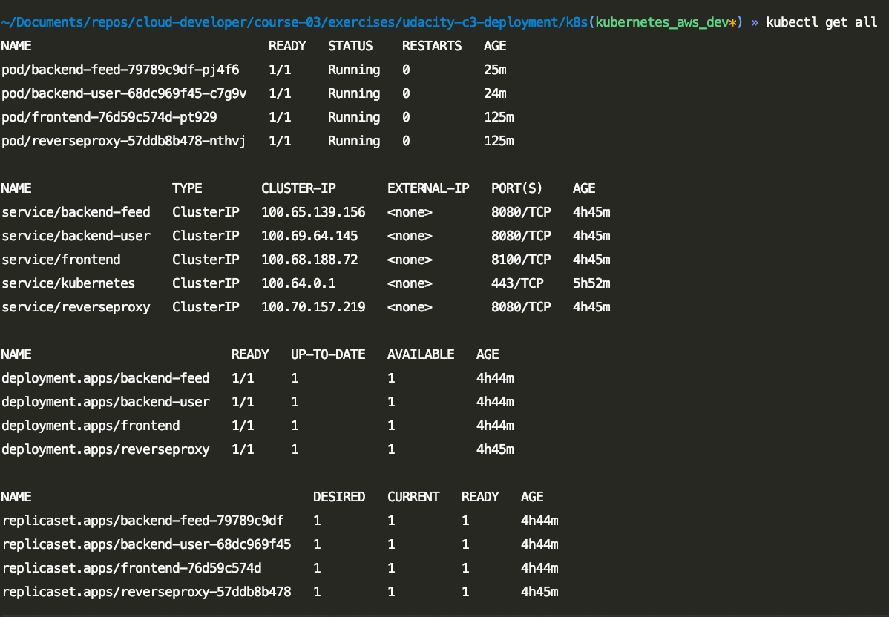

# cloud-developer - Monlith to Microservices
content for Udacity's cloud developer nanodegree

The images for submitting the 4th project for CDND:

### Image of containerized application on EKS AWS: 

### Screenshot of TravisCI Build:

### Image of docker images used created and pushed to DockerHub

###  Image of all pods, serives, and nodes

